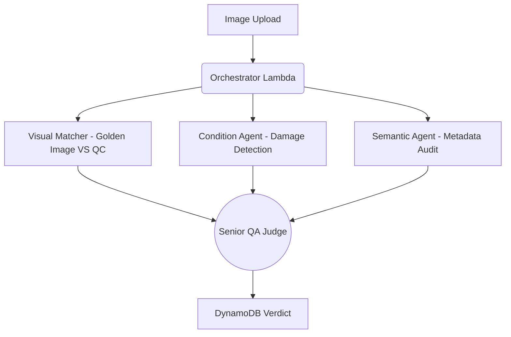
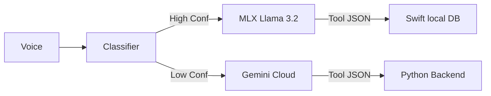

# Lenskart Hackathon 2.0 - Agentic Intelligence Workspace

This repository houses two primary projects focused on enhancing e-commerce operations through Agentic AI:

1.  **Catalog QA System**: A Parallel Multi-Agent system for automated eyewear quality assurance and SKU verification.
2.  **Voice Assistant (Bee)**: A 3-Tiered Intelligence Voice Assistant running Llama 3.2 on-device with Gemini cloud orchestration.

---

## 1. Catalog QA System (Updated)

### Approach: Parallel Multi-Agent Orchestration
The Catalog QA system has evolved into a robust **QA Manager** pattern. It utilizes three concurrent specialized agents to audit submissions before a senior "Judge Agent" makes a final decision based on absolute truth (Master DB).

#### Architecture


### Specialized Agents
- **Visual Matcher (Sonnet 3.5)**: Performs a dual-image comparison between the vendor's **QC Upload** and the **Golden Reference**. Detects structural SKU mismatches (wrong shape, color, material) and physical damage.
- **Condition Agent (Rekognition)**: Leverages Amazon Rekognition to flag severe defects (bent frames, missing lenses) and image quality failures.
- **Semantic Agent**: Audits product name, category, and price sanity through pure LLM reasoning.

### Rejection Rules (Absolute)
- **Rule 1 — Dual-Veto Damage**: REJECT if either Condition or Visual Matcher reports physical damage.
- **Rule 2 — SKU Mismatch**: REJECT if the product is structurally a different item from the Golden Image.
- **Rule 3 — Not Eyewear**: REJECT if the item does not belong to the eyewear category.

### Setup & Run
1. **Frontend (Next.js + Tailwind)**:
   ```bash
   cd catalog/frontend
   npm install
   npm run dev 
   ```
2. **Backend (Python Lambdas)**:
   - Environment: `BEDROCK_SMART_MODEL` = Claude 3.5 Sonnet.
   - S3 triggers the `upload_and_trigger` Lambda, which initiates the agentic `qc_pipeline`.

---

## 2. Voice Assistant App (Bee)

### Approach: 3-Tiered Intelligence
Bee maximizes on-device performance while maintaining cloud-level reasoning capabilities.

- **Tier 0**: Local N-gram Intent Classifier (Fast logic).
- **Tier 1 (Local LLM)**: Llama 3.2 3B Instruct (via MLX-Swift) for local tool calling (Order/Store DB).
- **Tier 2 (Cloud)**: Gemini 1.5 Flash handles complex logic, escalation, and cloud-bound tool execution.

### Architecture


### Setup & Run (iOS App)
To run the Bee Voice Assistant on a physical iPhone/iPad:

1. **Xcode Packages**: 
   - Add `https://github.com/ml-explore/mlx-swift`
   - Add `https://github.com/ml-explore/mlx-swift-lm`
2. **Download Model**: Download the **Llama-3.2-3B-Instruct-4bit** MLX weights.
3. **Attach to Bundle**:
   - Drag the model folder into Xcode.
   - Select **"Copy items if needed"** and **"Create groups"**.
   - **Crucial**: Ensure the app target is checked in "Target Membership".
   - Verify it appears in **Build Phases > Copy Bundle Resources**.
4. **Deploy**: Select your physical iPhone and press `Cmd + R`.

### Environment Variables
- `GEMINI_API_KEY`: Required for Tier 2 escalation.
- `AWS_REGION_NAME`: Target for Catalog Bedrock/Rekognition.
- `DYNAMODB_TABLE`: `CatalogQCTable`.

---

## Expected Outputs
- **Catalog**: A DynamoDB record with `qc_status` (APPROVED/REJECTED), `confidence_score` (0-100), and factual `reasoning`.
- **Assistant**: Real-time synthesized speech and tool execution summaries (e.g., "Looking up your store in New York...").

---

## Authors
- Amogh KM
- Aman Mehrishi
- Anirudh Sharma
